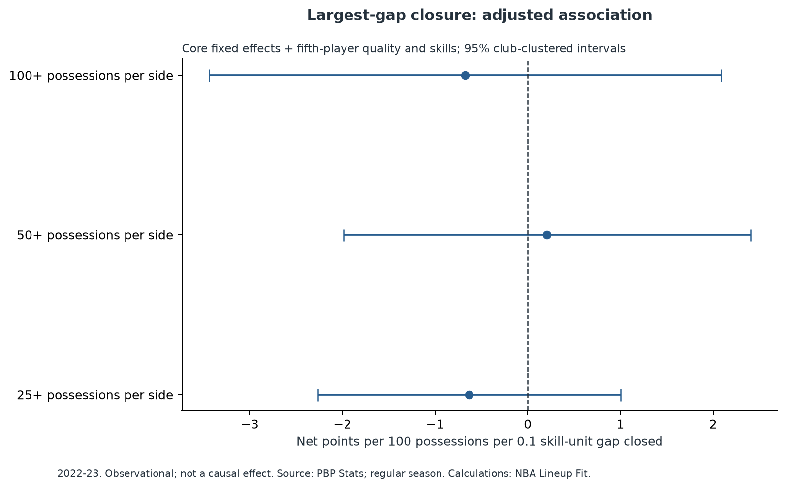

# NBA Lineup Fit Analysis Project

### Does the fifth player fill the gap?

## Research Question

**Does filling a four-player NBA lineup's largest skill deficiency improve lineup performance beyond simply adding the best available player?**

This project studies whether lineup complementarity provides measurable value beyond individual player talent.

The analytical framework is:

**Four-player core + fifth player → five-man lineup performance**

The objective is to separate two concepts:

- **Talent:** how good the fifth player is independently
- **Fit:** how well the fifth player's skills address the deficiencies of a specific four-player core

A null or inconclusive result is considered a valid research outcome.

---

## Current Result: Inconclusive Pilot

The initial 2022–23 pilot does not establish a measurable benefit from filling the largest identified skill deficiency.

The primary estimate is:

**+0.21 net points per 100 possessions per 0.1 standardized skill-unit gap closed**

with a **95% confidence interval of −1.99 to +2.40**.

The estimated effect changes sign across reasonable possession thresholds:

| Possessions per side | Comparison cores | Core/fifth rows | Effect per 0.1 gap unit | 95% interval |
|---|---:|---:|---:|---|
| 25 | 978 | 2,558 | −0.63 | [−2.27, +1.00] |
| 50 — primary | 430 | 1,018 | +0.21 | [−1.99, +2.40] |
| 100 | 143 | 320 | −0.68 | [−3.44, +2.09] |

Held-out franchise within-core contrast RMSE is **10.658** with quality and skill controls, compared with **10.691** after adding complementarity.

These results should be interpreted as preliminary one-season evidence rather than evidence that lineup fit does not matter.

---

## Scope

The intended analysis window is **2022–23 through 2025–26**.

The current pilot fully processes and models **2022–23**, using **2021–22** player data to construct lagged skill and talent profiles.

Current pilot coverage:

| Quantity | Count |
|---|---:|
| Retrieved teams | 30 |
| Retrieved games | 1,230 |
| Unique season-team five-player lineups | 16,752 |
| Distinct season-team four-player cores | 30,766 |
| Expanded core/fifth representations | 83,760 |
| Mean-side possessions, counted once per lineup | 244,628 |
| Eligible prior-season player profiles | 375 |
| Lineups with all five prior profiles | 4,905 |
| Primary comparison lineups | 358 |
| Primary comparison cores | 430 |
| Primary core/fifth rows | 1,018 |
| Franchises contributing to primary model | 24 |

Primary eligibility requires:

- 50 offensive possessions
- 50 defensive possessions
- valid prior-season profiles for all five players
- at least 500 prior-season minutes per player
- at least two eligible fifth players for the same four-player core

---

## Data

The project uses the **PBP Stats API** for lineup, player, and team totals.

PBP Stats is a derived play-by-play source rather than the official NBA Stats API.

The pipeline includes:

- team-level retrieval
- recursive date partitioning
- caching
- stable NBA player/team identifiers
- reconciliation against provider team totals
- reproducible request manifests

A 500-row API response cap required team-level and date-partitioned retrieval to recover omitted lineups.

Final pilot totals reconcile exactly to provider team totals for:

- seconds played
- offensive possessions
- defensive possessions
- points scored
- points allowed

Independent validation against official NBA totals remains an important future step.

Bulk raw and processed datasets are excluded from Git. Request URLs, timestamps, and checksums are preserved in `docs/data_manifest.json`.

---

## Analytical Unit

One analytical row represents:

**season + team + four-player core + fifth player**

Each observed five-player lineup generates five four-player-core/fifth-player representations.

For example:

```text
A B C D + E
A B C E + D
A B D E + C
A C D E + B
B C D E + A
```

Lineup net rating is defined as:

```text
100 × points / offensive possessions
−
100 × opponent points / defensive possessions
```

Exposure is counted at the original five-player lineup level to avoid multiplying possession weight across the five derived representations.

---

## Skill Dimensions

All player predictors are constructed from the **previous season** and standardized among players with at least 500 minutes.

| Skill dimension | Initial proxy |
|---|---|
| Shooting / spacing | 3PA per 100 possessions + smoothed 3P accuracy |
| Playmaking | Assists per 100 offensive possessions |
| Shot creation | Unassisted field-goal points per 100 offensive possessions |
| Rebounding | Offensive and defensive rebounds per 100 corresponding possessions |
| Interior activity | Blocks per 100 defensive possessions |

The final category is intentionally labeled **interior activity**, not overall defense. Public box-score data does not adequately capture complete defensive value.

---

## Talent

Fifth-player talent is represented by:

**prior-season Game Score per 36 minutes, standardized within season**

This serves as a reproducible prior-production proxy.

It does not use the current five-man lineup's performance and therefore avoids direct leakage from the outcome being modeled.

Game Score is not treated as a complete player-impact metric.

---

## Four-Player Core Profile

The core profile is the mean of the four players' standardized skill values.

For each core:

1. Calculate its average score on each skill dimension
2. Compare those values with the season-standardized player population
3. Identify the largest below-average skill gap

An entirely above-average core has no measured deficiency under the current specification.

---

## Complementarity

The initial complementarity measure asks:

> How much does the fifth player improve the four-player core's weakest measured skill toward league average?

If:

- `c` = the core's weakest skill score
- `s` = the fifth player's score on that skill

then:

```text
fill = min(max(0, −c), max(0, (s − c) / 5))
```

The score is capped once the measured deficiency is fully filled.

This is an initial operational definition rather than a universal measure of basketball fit.

Alternative formulations are retained for sensitivity analysis.

---

## Statistical Model

The primary specification uses possession-weighted linear regression with:

- four-player-core fixed effects
- prior fifth-player quality
- all five fifth-player skill main effects
- complementarity
- franchise-clustered uncertainty

Conceptually:

```text
Lineup Performance
=
Core Effects
+ Fifth-Player Talent
+ Fifth-Player Skills
+ Complementarity
+ Error
```

Core fixed effects allow comparisons among different fifth players who actually played alongside the same four-player core.

The analysis therefore focuses on **within-core variation** rather than comparing unrelated lineups.

---

## Sensitivity Analysis

The pilot includes:

- 25-, 50-, and 100-possession eligibility thresholds
- capped largest-gap closure
- all-gap closure
- uncapped interaction specifications
- exclusion of interior activity
- weighted and unweighted regression
- models with and without fifth-player skill main effects

No tested specification currently provides clear positive evidence that the proposed complementarity measure independently improves lineup performance.

Full coefficient outputs are available in:

`docs/model_coefficients.csv`



---

## Basketball Example

One high-exposure eligible core consists of:

- Trae Young
- Dejounte Murray
- De'Andre Hunter
- John Collins

The lagged skill profile identifies **interior activity** as the core's weakest measured dimension.

Under the current complementarity definition:

- Clint Capela fully closes the measured gap
- Onyeka Okongwu fully closes the measured gap
- Bogdan Bogdanović does not

Because the metric is capped once the deficiency is filled, it cannot distinguish Capela from Okongwu on this dimension.

This example illustrates both the intuition behind the complementarity measure and one of its limitations.

It is not evidence of a causal substitution effect.

---

## Project Structure

```text
nba-lineup-fit/
│
├── README.md
├── requirements.txt
├── requirements-lock.txt
├── run.py
│
├── .github/
│   └── workflows/
│       └── tests.yml
│
├── data/
│   ├── raw/
│   └── processed/
│
├── src/
│   ├── data_pipeline.py
│   ├── lineups.py
│   ├── features.py
│   ├── models.py
│   ├── analysis.py
│   └── notebooks.py
│
├── notebooks/
│
├── sql/
│   └── analysis_queries.sql
│
├── tests/
│   └── test_research_invariants.py
│
├── figures/
│
└── docs/
```

---

## Reproduction

Tested with **Python 3.12 on Windows**.

Create a virtual environment:

```powershell
python -m venv .venv
```

Install dependencies:

```powershell
.venv/Scripts/python -m pip install -r requirements.txt
```

Run tests:

```powershell
.venv/Scripts/python -m unittest discover -s tests -v
```

Reproduce the 2022–23 pilot:

```powershell
.venv/Scripts/python run.py --seasons 2022-23 --download --notebooks
```

Recompute from cached data:

```powershell
.venv/Scripts/python run.py --seasons 2022-23 --notebooks
```

Run the intended multi-season workflow:

```powershell
.venv/Scripts/python run.py --download --notebooks
```

On macOS or Linux, replace `.venv/Scripts/python` with `.venv/bin/python`.

---

## Limitations

The current pilot has several important limitations.

### One modeled outcome season

The primary result currently relies on 2022–23 lineup outcomes. A larger multi-season sample is necessary to determine whether the observed estimates are stable.

### Sparse lineup samples

Four-player-core/fifth-player combinations become sparse quickly as possession thresholds increase.

This produces a tradeoff between:

- reliability of individual lineup estimates
- number of usable observations

### Player skill measurement

The current features rely primarily on box-score-derived statistics.

They do not fully capture:

- shooting gravity
- passing opportunities
- shot difficulty
- screening
- defensive positioning
- switching ability
- matchup versatility
- off-ball movement

### Defensive measurement

Blocks per defensive possession are used only as an interior-activity proxy.

They should not be interpreted as comprehensive defensive value.

### Talent measurement

Prior-season Game Score per 36 is an interpretable production control but does not fully measure player impact.

Residual talent confounding is therefore possible.

### Selection bias

The observed fifth players were selected by real NBA coaches and roster construction decisions.

The analysis does not observe the full set of alternative players who could theoretically have joined each core.

### Context

The current specification does not directly control for:

- opponent strength
- garbage time
- injuries
- matchup-specific substitutions
- coaching strategy

### Dependence

Many players and games contribute to multiple lineup observations.

Franchise-level clustered uncertainty does not capture every possible source of dependence.

### Observational interpretation

The project estimates statistical associations within observed NBA lineups.

It does not currently support causal claims about what would happen if a team replaced one player with another.

---

## Next Steps

Planned extensions include:

1. Expand the modeled sample across multiple NBA seasons
2. Validate game and team totals against an independent NBA source
3. Improve the fifth-player talent measure
4. Develop stronger defensive and spacing proxies
5. Compare alternative core aggregation methods
6. Test alternative deficiency and complementarity definitions
7. Evaluate sensitivity to player-minutes and lineup-possession thresholds
8. Add stronger season-forward validation
9. Improve uncertainty estimates for shared-game and overlapping-player dependence
10. Develop interpretable NBA case studies after the statistical framework is stable

The objective of these extensions is not to force evidence in favor of complementarity, but to determine whether the conclusion changes under more complete data and more defensible measurement.

---

## Research Principle

This project is designed to answer the basketball question rather than confirm a preferred hypothesis.

If complementarity matters, the analysis should quantify where and how much.

If individual talent dominates fit, that is also an informative result.

If results remain inconclusive, the project should make clear why the available evidence is insufficient.
